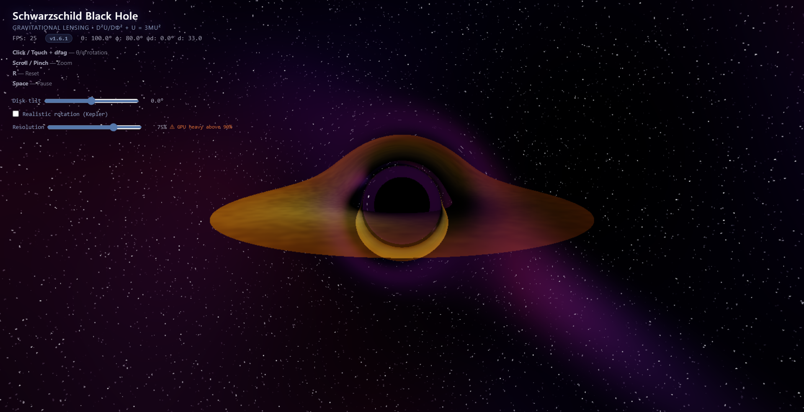

# Schwarzschild Black Hole — Gravitational Lensing

Interactive real-time simulation of gravitational lensing around a Schwarzschild black hole, rendered entirely on GPU via WebGL2.

This project visualises how gravity bends light near a non-rotating black hole, producing the iconic photon ring, gravitational arcs, and the dark "shadow" at the centre. The accretion disk displays Doppler beaming, gravitational redshift, and procedural turbulence.

> **Inspired by**: the first image of M87* by the Event Horizon Telescope (2019) and the black hole sequence in *Interstellar* (2014), based on physicist Kip Thorne's equations.

## Table of Contents

- [Version](#version)
- [Preview](#preview)
- [Physics](#physics)
  - [Schwarzschild Metric](#schwarzschild-metric)
  - [Light Geodesics](#light-geodesics)
  - [Simulation Parameters](#simulation-parameters)
  - [Why ALPHA = 8.0?](#why-alpha--80)
  - [Design Choices: Physics vs. Visuals](#design-choices-physics-vs-visuals)
  - [Impact Parameter and Capture](#impact-parameter-and-capture)
- [Rendering](#rendering)
  - [Ray Marching (Backtrace)](#ray-marching-backtrace)
  - [Adaptive Step Sizing](#adaptive-step-sizing)
  - [Accretion Disk](#accretion-disk)
    - [Temperature Profile](#temperature-profile)
    - [Doppler Beaming](#doppler-beaming)
    - [Gravitational Redshift](#gravitational-redshift)
    - [Turbulence](#turbulence)
    - [Photon Ring Boost](#photon-ring-boost)
  - [Background: Stars and Cosmic Filaments](#background-stars-and-cosmic-filaments)
  - [Shadow Effects](#shadow-effects)
  - [Performance](#performance)
- [Controls](#controls)
- [Running the Simulation](#running-the-simulation)
  - [GitHub Pages (recommended)](#github-pages-recommended)
  - [Docker (local)](#docker-local)
  - [Local (any static server)](#local-any-static-server)
- [Known Limitations](#known-limitations)
- [Stack](#stack)
- [References](#references)

## Version

| Field | Value |
|-------|-------|
| **Current version** | `v1.1.16` |
| **Latest commit** | pending |
| **Release date** | 2026-07-01 |

Version history is tracked via [Git tags](https://github.com/TristanHottier/BH_Sim/tags) and reflected in the HUD badge during runtime. See [`version.json`](version.json) for machine-readable metadata.

## Preview



## Physics

### Schwarzschild Metric

The black hole is modelled by the Schwarzschild metric, the exact solution to Einstein's field equations for a spherical, non-rotating, uncharged body:

$$ds^2 = -\left(1 - \frac{r_s}{r}\right) c^2 dt^2 + \left(1 - \frac{r_s}{r}\right)^{-1} dr^2 + r^2 d\Omega^2$$

where $r_s = 2M$ is the Schwarzschild radius (the event horizon).

In this simulation, $c = 1$ (geometric units) and $r_s = 1.0$, so $M = 0.5$.

### Light Geodesics

Light follows null geodesics in spacetime. In the equatorial plane, the exact orbital equation is:

$$\frac{d^2u}{d\varphi^2} + u = 3Mu^2 \quad \text{where} \quad u = \frac{1}{r}$$

The $3Mu^2$ term is the relativistic correction — absent in Newtonian mechanics. This is what produces gravitational lensing.

### Simulation Parameters

| Parameter | Value | Meaning |
|-----------|--------|---------|
| $M$ | 0.5 | Black hole mass (geometric units, $r_s = 2M = 1.0$) |
| $\text{ALPHA}$ | 8.0 | Gravitational curvature factor |
| $b_\text{crit}$ | $\approx 6.93$ | Critical impact parameter (capture threshold) |
| $\text{DISK}_\text{IN}$ | 1.125 | Inner radius of the accretion disk (adjusted ISCO for ALPHA = 8) |
| $\text{DISK}_\text{OUT}$ | 25.0 | Outer radius of the accretion disk |
| $\text{DISK}_\text{SIGMA}$ | 0.10 | Vertical disk thickness (Gaussian) |
| RK4 steps | 900 max | Maximum integration steps (adaptive) |
| Adaptive step | 0.005 → 2.0 | Step size (finer near the black hole) |

### Why ALPHA = 8.0?

In exact general relativity, the curvature factor would be $\text{ALPHA} = 3$ (corresponding to the $3Mu^2$ term in the orbital equation). The value $\text{ALPHA} = 8.0$ is **stronger than real physics** — it is chosen to make gravitational lensing effects **visually more prominent**.

This is an aesthetic trade-off: with $\text{ALPHA} = 3$, gravitational arcs are more subtle and less visible on screen. With $\text{ALPHA} = 8.0$, we get well-defined multiple images and photon rings.

> **Note**: The shadow radius is proportional to ALPHA. With ALPHA = 8, the capture radius is $b_\text{crit} = 3\sqrt{3} \cdot M \cdot \frac{\text{ALPHA}}{3} \approx 6.93$.

### Design Choices: Physics vs. Visuals

This simulation balances physical accuracy with visual clarity. Some parameters are deliberately adjusted for aesthetic reasons:

- **$\text{ALPHA} = 8.0$** instead of the physically correct $3$: enhances lensing visibility.
- **$\text{DISK}_\text{IN} = 1.125$** is the adjusted ISCO for the modified metric with $\text{ALPHA} = 8$: $r_\text{ISCO} = \frac{18M}{\text{ALPHA}} = \frac{9}{8} = 1.125$. In standard Schwarzschild ($\text{ALPHA} = 3$), the ISCO would be $6M = 3.0$.
- **$\text{DISK}_\text{OUT} = 25.0$**: not physically derived. Chosen to fill the field of view at typical camera distances without reaching the ray marching limit ($MAX_R = 500$).
- **$\text{DISK}_\text{SIGMA} = 0.10$**: thin disk approximation. Real accretion disks have H/r ~ 0.01–0.1, so this is within a realistic range for a geometrically thin disk.
- **$M = 0.5$** ($r_s = 1.0$): arbitrary mass scale. The simulation is dimensionless — only ratios matter.

### Impact Parameter and Capture

The impact parameter $b = |\vec{r} \times \vec{v}|$ measures the minimum distance to the center if light were not bent. If $b < b_\text{crit}$, the ray is captured by the black hole — this is the shadow.

The shadow radius projected on screen is:

$$R_\text{shadow} = \frac{b_\text{crit}}{d_\text{cam} \cdot \tan(\text{FOV}/2)}$$

## Rendering

### Ray Marching (Backtrace)

Each pixel launches a ray from the camera toward the black hole. The ray is integrated step by step using **RK4** (4th-order Runge-Kutta):

$$\frac{d\vec{x}}{d\lambda} = \vec{v}, \quad \frac{d\vec{v}}{d\lambda} = -\frac{\text{ALPHA} \cdot M \cdot \vec{x}}{|\vec{x}|^3} - \frac{3M \cdot (\vec{v} \cdot \vec{x})}{|\vec{x}|^3} \cdot \vec{v}$$

The acceleration has two components:
1. **Radial**: $-\text{ALPHA} \cdot M \cdot \vec{x} / r^3$ — gravitational attraction (scaled by ALPHA).
2. **Tangential**: $-3M \cdot (\vec{v} \cdot \vec{x}) / r^3 \cdot \vec{v}$ — transverse deflection from the curvature of spacetime. This component is zero in Newtonian gravity and is essential for producing realistic lensing arcs.

### Adaptive Step Sizing

The integration step $h$ adapts based on distance to the black hole:

| Distance $r$ | Step $h$ | Reason |
|-------------|---------|--------|
| $r < 1.2$ | 0.005 | Event horizon — rays bend most sharply |
| $1.2 < r < 1.5$ | 0.01 | Photon sphere — extreme curvature |
| $1.5 < r < 2.0$ | 0.02 | Just outside horizon — strong bending |
| $2.0 < r < 3.0$ | 0.04 | Inner disk region — high curvature |
| $3.0 < r < 6.0$ | 0.08 | ISCO to inner disk — moderate curvature |
| $6.0 < r < 12.0$ | 0.2 | Mid-disk — rays nearly straight |
| $12.0 < r < 30.0$ | 0.8 | Outer disk — minimal bending |
| $r > 30.0$ | 2.0 | Far field — rays are essentially straight lines |

This ensures accuracy near the black hole while keeping distant rays fast to compute.

### Accretion Disk

The disk lies in the equatorial plane ($y = 0$), with a Gaussian vertical profile. It is tilted by the `uDiskPsi` slider (rotation around the X axis).

#### Temperature Profile

Following the standard thin-disk model (Shakura–Sunyaev):

$$T(r) \propto \left(1 - \frac{r_\text{in}}{r}\right)^{3/4}$$

The inner edge is hottest (white-hot, ~10⁶ K equivalent) and the outer edge is coolest (orange/red). Temperature maps to a blackbody color:

| Temperature | Color |
|-----------|-------|
| Hot (inner) | White-blue |
| Medium | Yellow-white |
| Cool (outer) | Orange-red |

#### Doppler Beaming

The approaching side of the disk (moving toward the camera) appears brighter and bluer; the receding side appears dimmer and redder. The full relativistic Doppler factor is:

$$\delta = \left(\frac{1 + \beta\cos\varphi}{1 - \beta\cos\varphi}\right)^3$$

where:
- $\beta = \sqrt{GM/r}$ is the orbital velocity at radius $r$
- $\varphi$ is the angle between the gas velocity and the line of sight
- The cubic power accounts for both the frequency shift and the photon arrival rate

This is computed dynamically per intersection point, using the tangent velocity vector transformed into world space (accounting for disk inclination).

#### Gravitational Redshift

Light climbing out of the gravitational well loses energy:

$$z = \sqrt{1 - \frac{r_s}{r}}$$

This further reddens the outer disk and adds a subtle color modulation to the overall emission.

#### Turbulence

Procedural turbulence simulates the chaotic gas dynamics of a real accretion disk. Two modes are available:

1. **Cinematic (default)**: rigid-body rotation — the entire disk rotates as one unit. Produces dramatic, clearly visible spiral structures.
2. **Realistic (Kepler)**: differential rotation — inner regions orbit faster than outer regions ($\omega \propto r^{-3/2}$). More physically accurate but subtler.

Both use **FBM (Fractional Brownian Motion)** noise with 5 octaves, rotated at each octave for organic-looking structures. A spiral overlay adds arm-like features.

#### Photon Ring Boost

Rays that complete approximately one orbit around the black hole (total angle between $0.75\pi$ and $1.25\pi$) receive a brightness boost:

$$\text{boost} = 1 + 4 \cdot \left(1 - \frac{|n_\text{orbits} - 1|}{0.25}\right)$$

This simulates the photon ring — a bright ring of light formed by photons that orbit the black hole once before escaping to the camera.

### Background: Stars and Cosmic Filaments

- **Stars**: procedurally generated on a 3D grid using hash-based noise per cell. Three layers of stars with varying brightness and density produce a natural-looking field. Stars have a slight blue tint to stand out against disk reflections.
- **Cosmic filaments**: a blue band across the sky, reminiscent of the Milky Way. Generated with layered sinusoidal modulations representing large-scale cosmic web filaments — the faint, glowing structures that permeate intergalactic space.
- **Nebula**: a violet-pink nebula overlay adds depth to the background.

### Shadow Effects

Two visual effects frame the black hole shadow:

1. **Shadow edge glow**: a thin blue-white fringe just outside the shadow boundary, simulating photons that skim the photon sphere.
2. **Inner shadow glow**: a subtle blue fringe just inside the shadow, from photons on near-capture trajectories.
3. **Shadow border** (toggleable): a thin white circle marking the shadow boundary, useful for visual reference.

### Performance

- Resolution scaled to 50% of screen size (capped at 1× DPR) for playable FPS.
- Tone mapping: $c \mapsto c / (1 + c)$ — compresses bright values to prevent clipping.
- Emissive disk glow: radial projection of the disk edges adds a warm halo without full bloom post-processing.
- Early-out conditions: rays hitting the event horizon or exceeding `MAX_R = 500` terminate immediately.

## Controls

| Action | Control |
|--------|---------|
| θ/φ rotation | Click + drag / single-finger drag |
| Zoom | Mouse wheel / pinch-to-zoom (2 fingers) |
| Reset | R |
| Pause | Space |
| Disk inclination | Slider (tilt around X axis) |
| Realistic rotation mode | Kepler checkbox |
| Shadow border | Checkbox |

### Camera Parameters (default)

| Parameter | Value | Description |
|-----------|-------|-------------|
| $\theta$ | 100° | Azimuthal angle (around Z axis) |
| $\phi$ | 80° | Polar angle (from Z axis) — near edge-on |
| Distance | 45.0 | Camera distance from black hole |
| FOV | 60° | Field of view |

Zoom range: 35–100 units. Polar angle range: 0.001°–179.999° (0° to 180°).

## Running the Simulation

### GitHub Pages (recommended)

The simulation is hosted directly on GitHub Pages — no setup required:

**https://tristanhottier.github.io/BH_Sim/**

### Docker (local)

```bash
docker compose up --build
```

Access at `http://localhost:8080`.

### Local (any static server)

Serve the project root with any HTTP server:

```bash
# Python
python -m http.server 8080

# Node.js
npx serve .

# PHP
php -S localhost:8080
```

Access at `http://localhost:8080`.

> **Note**: Opening `index.html` directly via `file://` will not work, as the GLSL shaders are loaded via `fetch()`.

## Known Limitations

This is a **visual simulation**, not a scientific tool. Several approximations are made:

1. **Schwarzschild metric only**: the black hole is non-rotating. Real astrophysical black holes spin (Kerr metric), which produces frame-dragging and an asymmetric shadow.
2. **ALPHA = 8.0**: the gravitational curvature is 2.7× stronger than GR predicts. This enhances visual impact but is not physical.
3. **No ray deflection at the disk**: rays passing through the disk are not bent by its mass (the disk's gravity is negligible compared to the black hole's).
4. **No radiative transfer**: the disk is a thin emissive surface, not a volumetric medium. Self-occultation (the back side of the disk hidden by the black hole) is approximated but not fully modelled.
5. **No polarization**: real black hole images carry polarisation information from synchrotron emission. This simulation computes intensity only.
6. **Single-pass rendering**: no multi-pass bloom or anti-aliasing. The glow effect is a heuristic approximation.
7. **900 RK4 steps max** (adaptive): rays near the photon sphere use tiny steps (0.005–0.04), but most of the path uses large steps. An orbit safeguard (3 full orbits) prevents infinite loops. Some extreme rays may still not converge fully — a performance trade-off.

## Stack

- **HTML5** — semantic structure with viewport meta for mobile support
- **CSS3** — fullscreen canvas, HUD with auto-fade, responsive media queries (mobile-first)
- **Vanilla JavaScript** — WebGL2 context management, camera controls, render loop
- **WebGL2 (GLSL ES 300)** — vertex shader (fullscreen quad), fragment shader (all physics + rendering)
- **Nginx** — Docker container for static file serving

## References

- Schwarzschild, K. (1916). Über das Gravitationsfeld eines Massenpunktes. *Sitzungsberichte der Königlich Preußischen Akademie der Wissenschaften*.
- Synge, J.L. (1966). *Relativity: The General Theory*. North-Holland.
- Luminet, J.P. (1979). Image of a spherical black hole with spherical accretion disk. *Astronomy & Astrophysics*, 75, 228–235.
- Bardeen, J.M. (1973). Timelike and null geodesics in the Kerr metric. In *Black Holes (Les Houches Sessions)*.
- Peebles, P.J.E. & Ratra, B. (2003). The cosmological constant and dark energy. *Reviews of Modern Physics*, 75(2), 559.
- Event Horizon Telescope Collaboration (2019). First M87 Event Horizon Telescope Results. I. The Shadow of the Supermassive Black Hole. *The Astrophysical Journal Letters*, 875(1), L1.
- Shakura, N.I. & Sunyaev, R.A. (1973). Black holes in binary systems. Observational appearance. *Astronomy & Astrophysics*, 24, 337–355.
- Thorne, K. (1995). *Black Holes and Time Warps*. W.W. Norton & Company.
